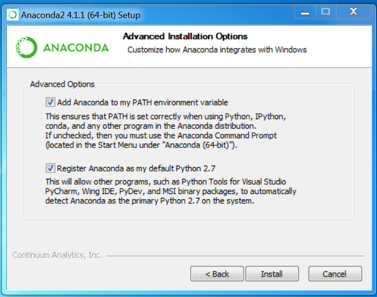
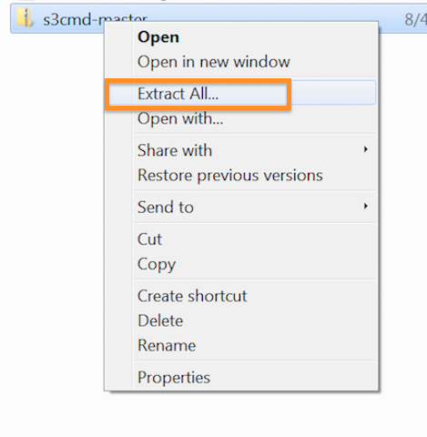
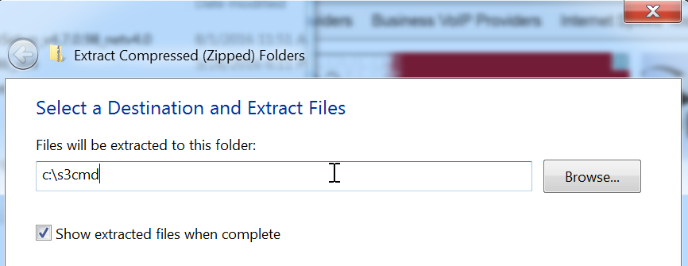
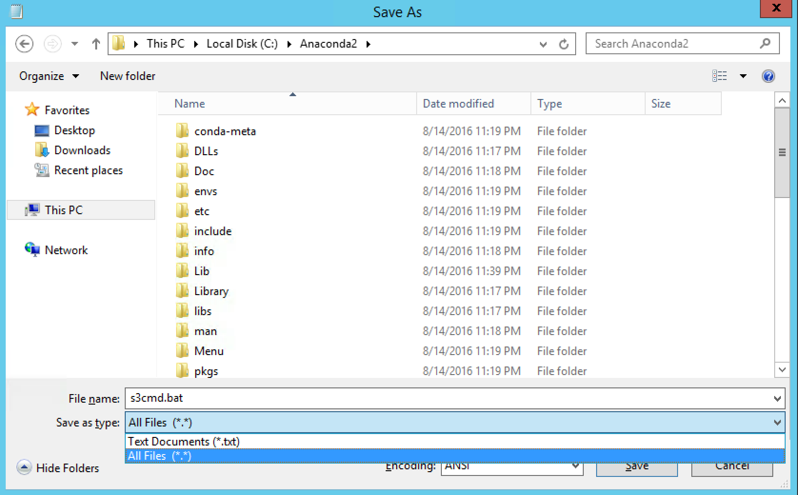

# Alternate Windows pre-requisites

This is an alternate, in case downloading the full anaconda package was not working for you.

## Getting Python installed

1.  Download and install the Microsoft VC++ Compiler for Python 2.7: http://aka.ms/vcpython27
2.  Grab the *Mini* Conda installer for python 2.7:

* [32-bit version](https://repo.continuum.io/miniconda/Miniconda2-latest-Windows-x86.exe)
* [64-bit version](https://repo.continuum.io/miniconda/Miniconda2-latest-Windows-x86_64.exe)
3.  Select `All users (requires admin privileges)` .  If you do not have admin privileges, choose the `Just Me` option, however you will need to adjust some folder paths in later instructions.  

4.  Make sure on the 'Advanced Installation Options' page you leave both boxes Checked as shown below:

	

	*Note: this may take several minutes to install*

5.  Once its installed, you should see an 'Anaconda2' folder in your Start menu under 'All Programs'

6.  To verify all is well, click on the 'Anaconda Prompt' icon, which should launch a command window.  Type the following into it:

		python --version

You should see something similar to:

	Python 2.7.13 :: Continuum Analytics Inc

## Getting python modules & dependancies

There are a few ways to get python modules installed in Windows, the simplest is to use 'pip'.  Luckily, pip is included with the Anaconda install on windows.

1.  Go to your Anaconda Prompt window. (`All Programs -> Anaconda2 -> Anaconda Prompt`)
2.  Once there, type:

		pip install boto3

	The last line of output should look similar to this:

		Successfully installed boto3-1.4.0 botocore-1.4.43 jmespath-0.9.0 s3transfer-0.1.1

3.  From the same prompt window, type:

		pip install jupyter

4.  Make sure that you can get jupyter notebok to run.  In the same prompt window:

		jupyter notebook

	It should launch a web browser to a notebook page, if it does, you can move those windows to the side, you'll be using them later.

5.  For a final check, launch another `Anaconda Prompt` window.  In that window, type the following and hit the `<enter>` key:

		import boto3
	If all is well, you will not get any output to the screen.  This means that the boto3 library was successfully installed and is able to be loaded into the Python environment.

You have now got python and dependancies setup and installed on Windows!

## (Optional) S3cmd setup

1.  Download the latest zip file from [here](https://github.com/s3tools/s3cmd/archive/master.zip)
2.  Find the file you downloaded in Windows Explorer (usually in `Downloads`), right click, then `Extract all` .  Make sure to change the path to `c:\s3cmd`

	

	

3.  Next you will need to open up your `Anaconda Prompt` window, and change Directories.  EG:

		cd c:\s3cmd\s3cmd-master

4.  Run the following command to install s3cmd:

		python setup.py install

5.  In the same `Anaconda` window, you should be able to run the following :

	python s3cmd --version

It should return something like this:

	s3cmd version 1.6.1

 To make it easy to run s3cmd in the future, you're going to create a quick .bat file.  

1.  Open up `notepad`
2.  Put the following text in:

		python.exe c:\s3cmd\s3cmd-master\s3cmd %*

3.  Save the file into `c:\Anaconda2` , and name it `s3cmd.bat`

	***Make sure to change the 'Save as type' to 'all files'***

	

4.  Close out of your anaconda window, and re-open
5.  You should now be able to simply run:

		s3cmd --version

## CloudBerry & CyberDuck

For a graphical interface to Igneous and S3, you can follow either or both of these guides to get CloudBerry S3 Explorer & Cyberduck installed and configured on your system:

* [CloudBerry S3 Explorer Free](https://community.igneous.io/hc/en-us/articles/222825147-CloudBerry-S3-Explorer-Free)
* [Cyberduck](https://community.igneous.io/hc/en-us/articles/222874108-Cyberduck-guide)

Now you have your pre-requisites taken care of.
